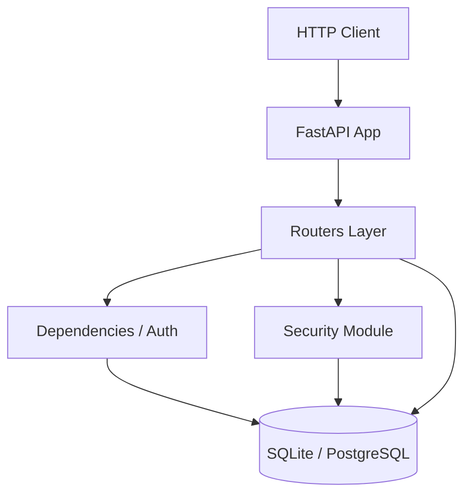
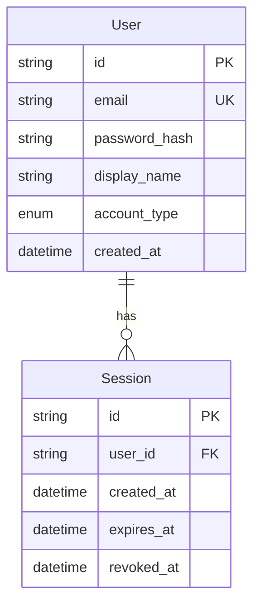

# System Patterns: Open Table RPG

## Architecture Overview



**Pattern:** Layered monolith with FastAPI. All code lives under `src/app/` and runs from `src/main.py`.

## Directory Structure

```
src/
  main.py              # App factory, startup, uvicorn entry point
  app/
    __init__.py
    config.py           # pydantic-settings (env-based config)
    db.py               # SQLAlchemy engine, session factory, Base
    models.py           # ORM models (User, Session, future: Lobby, etc.)
    schemas.py          # Pydantic request/response models
    security.py         # Password hashing, session create/revoke/lookup
    deps.py             # FastAPI dependency injection (get_current_user)
    routers/
      auth.py           # /api/gm/register, /api/login, /api/logout, /api/whoami
```

## Key Technical Decisions

### Framework & Runtime
- **FastAPI** with synchronous endpoints (no async DB driver).
- **Uvicorn** as ASGI server with `reload=True` for dev.
- Python >= 3.11, uses `from __future__ import annotations` everywhere.

### Database
- **SQLAlchemy 2.0** (mapped_column, Mapped types) with `DeclarativeBase`.
- Default dev DB: **SQLite** (`sqlite:///./app.db`), configurable via `OTRPG_DATABASE_URL` env var.
- PRD targets **PostgreSQL** for production.
- Tables auto-created on startup via `Base.metadata.create_all()` -- no Alembic migrations yet.
- UUIDs stored as `String(36)` (not native UUID type), generated with `uuid.uuid4()`.

### Authentication & Sessions
- **Cookie-based server-side sessions** (not JWT).
- Session model stored in DB with `expires_at` and `revoked_at`.
- Cookie: `session_id`, HttpOnly, SameSite=lax, configurable Secure flag.
- Session TTL: 14 days (configurable via `OTRPG_SESSION_TTL_SECONDS`).
- Auth dependency: `get_current_user()` reads cookie, validates session, returns `User` or 401.

### Password Security
- **Argon2** via `argon2-cffi`.
- `hash_password()` / `verify_password()` with constant-time comparison (Argon2 built-in).

### Configuration
- `pydantic-settings` with `OTRPG_` env prefix.
- Settings: `database_url`, `session_cookie_name`, `session_ttl_seconds`, `cookie_secure`.

### Email Handling
- Emails normalized to lowercase + stripped whitespace via `normalize_email()`.
- Uniqueness enforced via DB index (`ix_users_email_unique`).
- Validation uses `pydantic[email]` / `EmailStr`.

## Design Patterns

### Dependency Injection
FastAPI's `Depends()` for:
- DB session (`get_db` yields a session, auto-closes).
- Current user (`get_current_user` reads cookie, queries session+user).

### App Factory
`create_app()` in `main.py` constructs the FastAPI instance, registers startup events and routers. Module-level `app = create_app()` for uvicorn import.

### Response Models
Pydantic `BaseModel` subclasses as both request validation and response serialization. Router functions return Pydantic model instances directly.

## Data Model (Current State)



### Known Gaps vs PRD
- `AccountType` enum only has `GM` -- missing `PLAYER`.
- `User` model missing `updated_at` field.
- No `Lobby`, `LobbyMember`, or `Invite` models yet.
- `gm_register` endpoint returns `WhoAmIResponse` but the schema has `session_id` field while register doesn't set a session cookie (inconsistent -- register creates user but doesn't log them in).
- `WhoAmIResponse` uses `session_id` field name but login/whoami pass `user.id` into it (naming mismatch -- should probably be `id` or `user_id`).

## API Routes (Current)

| Method | Path | Auth | Description |
|--------|------|------|-------------|
| POST | `/api/gm/register` | No | Create GM account |
| POST | `/api/login` | No | Login, set session cookie |
| POST | `/api/logout` | Cookie | Revoke session, clear cookie |
| GET | `/api/whoami` | Cookie | Return current user info |

## Quality & Tooling
- **Linter/Formatter:** Ruff (line-length 100, py311 target, select E/F/I/B/UP, ignore B008)
- **Type Checker:** mypy (strict mode: disallow_untyped_defs, no_implicit_optional, strict_equality)
- **Dev Dependencies:** ruff, mypy, httpx (for test client)
- **Package Manager:** uv (uv.lock present)
- **Quality gate commands:** `uv run ruff check .`, `uv run ruff format --check .`, `uv run pytest`

## Next Implementation Steps
1. Add `PLAYER` to `AccountType` enum
2. Add `updated_at` to `User` model
3. Implement `Lobby` and `LobbyMember` models (US-002)
4. Implement `Invite` model (US-003)
5. Create lobby router with CRUD + membership endpoints
6. Create invite router with create/accept/decline endpoints
7. Add authorization dependencies for lobby-scoped actions
8. Add automated tests
